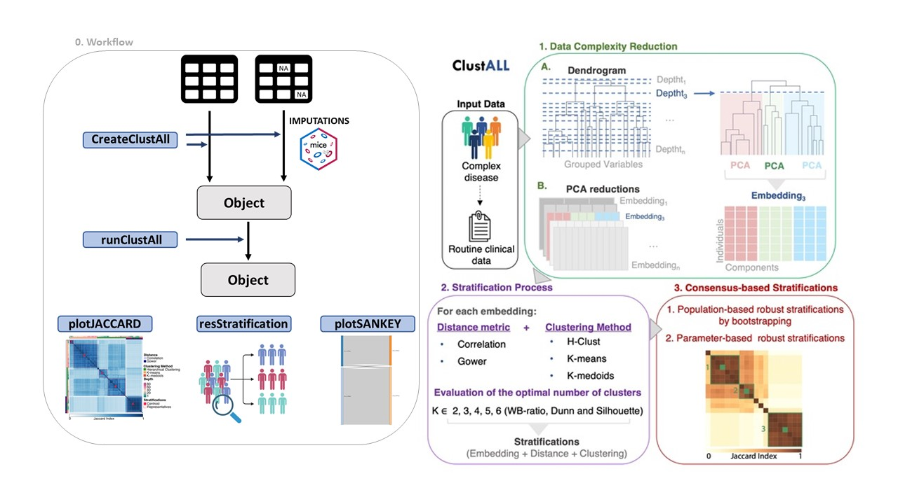

# ClustAll: an R package for Patient Stratification in complex diseases 

ClustAll is the R package implementation of ClustALL algorithm designed for patient stratification in complex diseases <https://doi.org/10.1101/2023.11.17.23298672>. In addition, ClustAll addresses common intricacies encountered in clinical data analysis, including mixed data types, missing values, and collinearity.

## Overview

Patient stratification is essential in biomedical research for understanding disease heterogeneity, identifying prognostic factors, and guiding personalized treatment strategies. The ClustAll underlying concept is that a robust stratification should be reproducible through various clustering methods. ClustAll employs diverse distance metrics (Correlation-based distance and Gower distance) and clustering methods (K-Means, K-Medoids, and Hierarchical Clustering).

ClustAll accepts missing data, binary, categorical, and numerical variables, internally transforming categorical features using a one-hot encoder. A minimum of two features are required as input. Depending if there are missing values, the ClustAll pipeline handles three different scenarios: (I) initial complete data (without missing values), (II) initial incomplete data (with missing values) imputed within ClustAll, and (III) data with missing values that have been imputed externally. Then by executing the ‘runClustAll’ method, the stratification of the input data is computed. Several methods are provided for exploration and interpretation of results (See Figure below).


#### ClustAll KEY FEATURES:

-   **Handles Diverse Data Types**, including missing values, mixed data, and correlated variables.

-   **Provides Multiple Stratification Solutions**, enabling exploration of different clustering algorithms and parameters.

-   **Robustness Analysis**, to identify stable and reproducible clusters.

-   **Validation**, for assessing the reliability of clustering results using ground truth (if available).

-   **Visualization** functions for interpreting clustering results and comparing different stratifications.





## Installation
### Basic instruction
ClustAll is developed using S4 object-oriented programming, and requires R [\>=4.2.0](https://www.r-project.org/). ClustAll is a pipeline that utilizes many other R packages that are currently available from CRAN or Bioconductor.

ClustAll will be soon available on Bioconductor. 

For installation:

``` 
if (!require("devtools")) 
    install.packages("devtools")
devtools::install_github("TranslationalBioinformaticsUnit/ClustAll")
```

## Quick start
Here is a quick start of the package.

``` 
library(ClustAll)
data("BreastCancerWisconsin", package = "ClustAll") # load the data 
obj_noNA <- createClustAll(data = data_use, nImputation = NULL,            # Create the object
                           dataImputed = NULL,colValidation = "Diagnosis")
obj_noNA1 <- runClustAll(Object = obj_noNA, threads = 2, simplify = FALSE) # Run the algotirhm
plotJACCARD(Object = obj_noNA1, stratification_similarity = 0.88)          # Explore robust stratifications
resStratification(Object = obj_noNA1, population = 0.05, 
                  stratification_similarity = 0.88, all = FALSE)
df <- cluster2data(Object = obj_noNA1,                                     # Export the resulst
                   stratificationName = c("cuts_c_3","cuts_a_9","cuts_b_9"))
```

## Citation
The paper is under submission. 


